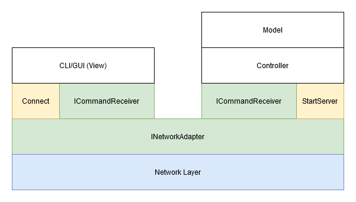
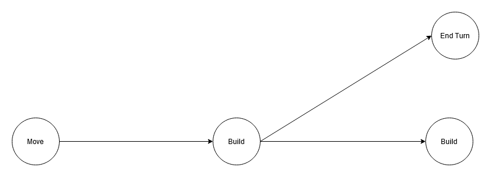

# Application Design

This document explains the main design decision we made in our project.

## Unusual MVC

In out project we decided to use a strict version of MVC like the on proposed by Apple.


Our model communicates only with the controller, there is no direct interaction with the view.

We also decided to use a synchronous model without callbacks because they make code less readable and break the normal flow of execution.
A few callbacks are fine and not that bad, for example we use 3 callback from the network layer to the controller/view.
But with the game (our sole model interface) we would have a huge amount of callbacks hard to debug and understand.

Another strong point of not using callback is that in case of error recovery is super simple!
If we were used a callback and receive a broken message who should handle the error?
The controller that has no knowledge of the model? The model itself? The callback? 
The best way in this case would be calling a different callback breaking the whole execution flow making the code hard to understand.

In our design we don't have this problem. The controller just recalculate the current "broken" move when `Game` returns an error!
This behaviour can be imagined as: "Controller try to run an action. If fail he can request again the action, otherwise it can calculate the next step of the match".
We traded the "controller knows nothing abound the model" to a half-way design. The controller knows just how game behave externally. 
Our model exposes the bare minimum getters to let the user (our controller) to know what game is doing and what to do to continue the match!

Please notice that it seems that our interface leaks `Game` internal implementation but is not, with the interface only common types are passed, no internal data is exposed!
`Game` public interface is like asking two people playing "how is going the match?". They both now about the map, the current player, ecc.

## Server is Absolute

We decided to make the client as light as possible, for this reason the server has full power over everything. 
Clients are just a "fancy switches" that let the user chose what to do only from a pre calculated list of actions.

This decision requires that the server is able to calculate exactly what to do. Our model and controller were designed to make this task as simple as possible, a single function call is able to calculate all the valid moves for a player!

The server power is not limited to "correct move predictions" but also decide the flow of the game. Clients only listen and display what the server wants!
For example the server decides who need to play and send a request to the client to chose something from the provided data.

For more details on how the client and server interact see [protocol document](protocol.md).

## Common Network

To keep the code clean and simple we decided to create a common network interface (`INetworkAdapter`) that uses two more interfaces: 
- `ICommandReceiver` defines what a network receiver should be able to handle
- `INetworkSerializable` defines the type of objects that the network layer can serialize

The main reason to have a common interface for both client and server is to allow us to reuse a lot of code.
For example both server and client read sockets, notify the upper layers in the same way.

Our overall architecture:



Using `INetworkAdapter` interface allows us to swap the network implementation any time without issues.
This interface alone is still not enough to have a good abstraction over the communication between the network layer and the upper levels.

We created `ICommandReceiver` to define a common way to "talk" to the upper level.
This interface defines a few callbacks called by the network layer when a specific event occur (eg: a command is received).
The main purpose of this interface is to listen to network event from any object we want. For example we use `ICommandReceiver` interface in both the Controller and the View to get data from the lower level.


With this interfaces we archived a good abstraction where the Network Layer and the above layers knows nothing of their respective internal representation but they can still interact with each other in a simple and common way achieving different results.

## Gods are Graphs

When designing Gods behaviour we had an hard time deciding what was the best way to create them.
Every God in the game has it's way to make changes on different parts of gameplay.
We thought how to represent a God "execution" and it become clear that they could be modelled as a one way graphs!

Like this one:



Every graph defines how the player can "move forward" in a turn and execute one action after another.
In our implementation every God is defined by his graph that is a sequence of customizable and reusable Actions!
We built stateless actions that could be customized with some constraints (for example a move that pushes the opponent worker is still a move).
This design allows us to create Gods by defining new Actions and combine them with existing ones to create new graphs!

To show how powerful is this approach with this line of code we created the base game turn without gods:
```java 
BehaviourGraph.makeEmptyGraph().appendSubGraph(
    BehaviourNode.makeRootNode(new MoveAction()).setNext(new BuildAction()).getRoot()
));
```

It's important to understand that Actions are stateless and execute the moves based on the game state data passed to them. 
Graphs are not stateless and keep a state to know what the player should do next! This state can be imagined as the current turn point of execution.