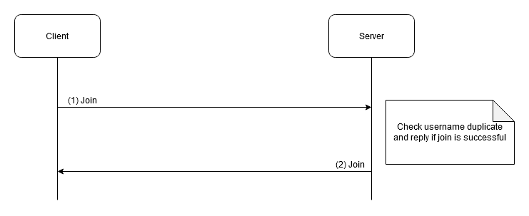
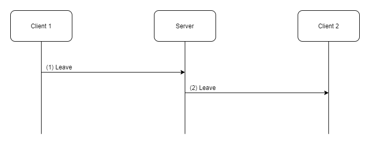
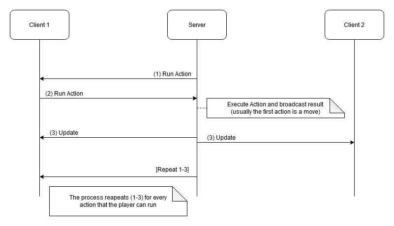

# Protocol Design

This document explains how our client and server communicate.

Our protocol is designed to be simple and compact. We chose to use JSON to serialize data because compared to other text serialization methods it's clean, simple and has really good libraries ready to use.

Later in this document you will find a more detailed discussion over the main game phases and their communication flow:
- [Join](#join)
- [Left](#left)
- [Setup](#setup)
- [Turn](#turn)
- [End Game](#end-game)

The protocol we created is based on the idea that the server has full control over almost any communication. If fact the server sends requests to client to let them know what they should do.

This choice serves to have a light client with almost no logic that receives instructions (we call them commands) from the server on what to do. We could imagine the client as a fancy switch that let the user chose what to do.

## Serialization
Every command is send as a JSON into a `CommandWrapper` class. This wrapper has the function to help the code to easily understand the type of command received.

`CommandWrapper` has this structure:

| Field   | Type         | Description |
|---------|--------------|-----------|
| type    | CommandType  | Type of command used to know how handle the command and read correct data | 
| data    | String       | Payload containing the real command |

### Base Command
Every command contained into the wrapper is a child of `BaseCommand` class that defines a base structure and common data share between all commands.
Every command is also serialized as a JSON and encapsulated in CommandWrapper as `data` string value.

| Field   | Type | Description                                            |
|---------|------|--------------------------------------------------------|
| sender  | int  | Sender ID                                              | 
| target  | int  | Target ID that should receive the command              |
| payload | *    | Specific data of the command defined in child commands |

### Types of Commands
This are all possible values of `CommandType` and they represent all possible commands sent between server and client.

| Type                | Client | Server | 
|---------------------|---------------------|---------------------|
| JOIN                | Request to join a match | -- |
| LEAVE               | Request to quit a match | -- | 
| START               | Ask the server to start a match (setup phase) | Request made by the host to start a match
| FILTER_GODS         | Request the host to pick the gods for the match | List of gods that should be used in the match |  
| PICK_GOD            | Request to to pick a god from the provided list | God pick by a player
| SELECT_FIRST_PLAYER | Request the host to chose the first player from a list| First player chosen by the host | 
| PLACE_WORKERS       | Request to place the workers in the map | Positions where the player wants to place his workers
| ACTION_TIME         | Request to chose a valid move to execute in the turn | Move that the player want to do | 
| UPDATE              | Update on the new map status | --
| END_GAME            | Win/Lose notification | --

Note that all the commands "order" to do something but this "forced actions" can also be game updates that the client should process, for example a map change.

## Errors

If a wrong command is issued to the server there are two possible ways what it's handled:
- Ignored if the player is not the current one
- Resend request if the wrong command is issued by the current player

# Game Phases

It this section we explain the main phases of the communication between clients and server.

No explicit `ACK` mechanism was implemented because the connections are all based on TCP so delivery of data is guaranteed by the protocol we use.

ClientIDs are highly variable positive integers that depend at what time the client first joined the game, in the next sections we put example ids and data.
ServerID is a negative number that is always static, is this schemas its presented as a string instead of a static number.

## Join

| Seq | CommandType | Sender   | Receiver | Payload                                |
|-----|-------------|----------|----------|----------------------------------------|
| 1   | JoinCommand | -        | ServerID | Username: `ElPicanto` IsJoin: `-`   |
| 2   | JoinCommand | ServerID | 1        | Username: `-` IsJoin: `true/false`  |

## Left

| Seq | CommandType  | Sender   | Receiver | Payload |
|-----|--------------|----------|----------|---------|
| 1   | LeaveCommand | 1        | ServerID | --      |

When a connection dies for every reason, the network layer generates a virtual `LeaveCommand` and passes it to the Controller.

## Setup

| Seq | CommandType            | Sender   | Receiver | Payload                                              |
|-----|------------------------|----------|----------|------------------------------------------------------|
| 1   | StartCommand           | 1        | ServerID | --                                                   |
| 2   | StartCommand           | ServerID | *        | PlayerIDs: `[1,2]`                                   |
| 3   | FilterGodCommand       | ServerID | 1        | GodsID: `[1,2,3,4,...]`                              |
| 4   | FilterGodCommand       | 1        | ServerID | GodsID: `[3,4]`                                      |
| 5   | PickGodCommand         | ServerID | 2        | GodsID: `[3,4]`                                      |
| 6   | PickGodCommand         | 2        | ServerID | GodsID: `[4]`                                        |
| 7   | FirstPlayerPickCommand | ServerID | 1        | PlayerID: `[1,2]` Usernames: `["Trash", "Panda"]` |
| 8   | FirstPlayerPickCommand | 1        | ServerID | PlayerID: `[2]`                                      |
| 9   | WorkerPlaceCommand     | ServerID | 2        | Positions: `[{0,0},{0,1},{0,2},{0,3},{0,4}...{6,6}]` |
| 10  | WorkerPlaceCommand     | 2        | ServerID | Positions: `[{0,0},{0,1}]`                           |
| 11  | WorkerPlaceCommand     | ServerID | 1        | Positions: `[{0,2},{0,3},{0,4}...{6,6}]`             |
| 12  | WorkerPlaceCommand     | 1        | ServerID | Positions: `[{1,1},{3,3}]`                           |

This schema is also valid for three players, just imagine to add an extra step to pick gods and place workers.
With three players the start command is not necessary, because the match has reached the max player count and automatically start.

## Turn

| Seq | CommandType   | Sender   | Receiver | Payload                                                                           |
|-----|---------------|----------|----------|-----------------------------------------------------------------------------------|
| 1   | ActionCommand | ServerID | 1        | IdWorkerNMove: `[0,2]` AvailablePos: `[{0,0},{0,1}]` ActionName: `["Move"]` |
| 2   | ActionCommand | 1        | ServerID | IdWorkerNMove: `[0]` AvailablePos: `[{0,1}]`                                   |
| 2   | UpdateCommand | ServerID | *        | MapWorkerPair: `[0,2,3,1...,1]` WorkerPos: `[{0,0},{6,6},{1,2}.{3,4}]`         |

The above schema applies to every to every turn for every player, no distinction is made

## End Game

| Seq | CommandType    | Sender   | Receiver | Payload                                |
|-----|----------------|----------|----------|----------------------------------------|
| 1   | EndGameCommand | ServerID | 1        | IsWinner: `false`                      |
| 2   | EndGameCommand | ServerID | 2        | IsWinner: `true`                       |

# Final Notes
This JSON implementation of the communication is far away from being the best and most performant solution that can be created.
A few example of how we could make the network faster are: 
- Dropping the JSON format and create a more compat serialization process
- Incremental map updates
- Data compression for integers (2 bytes are big enough to hold a Vector2)
- Dropping TCP in flavour a custom protocol over UDP
- ...

But the performance and the speed of the network are not that critical in a card game that has at best a few updates per second, so we kept things simple and used JSON.

 